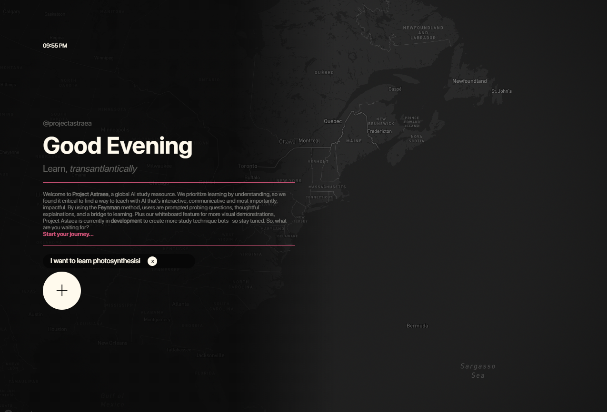
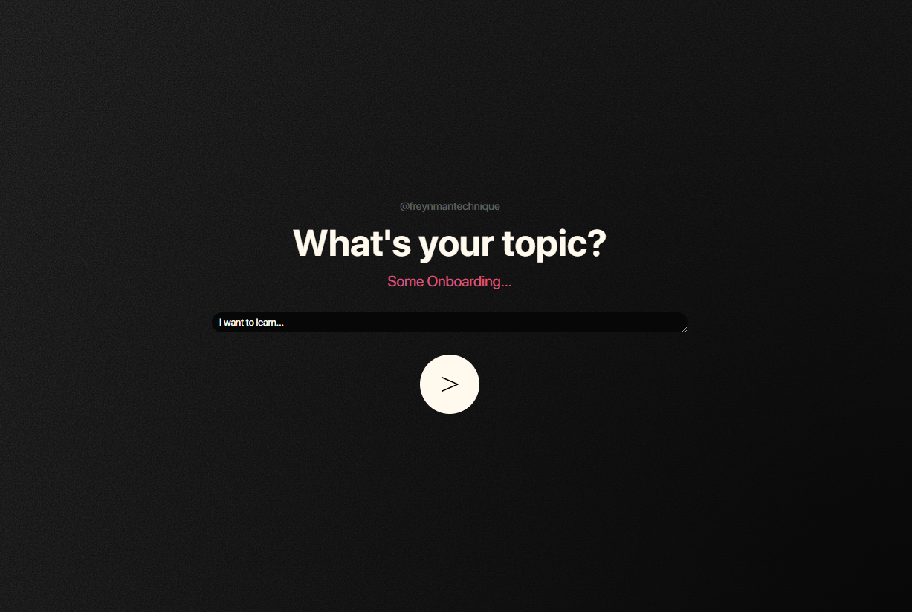
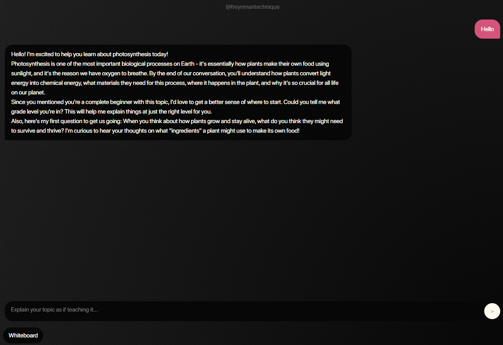
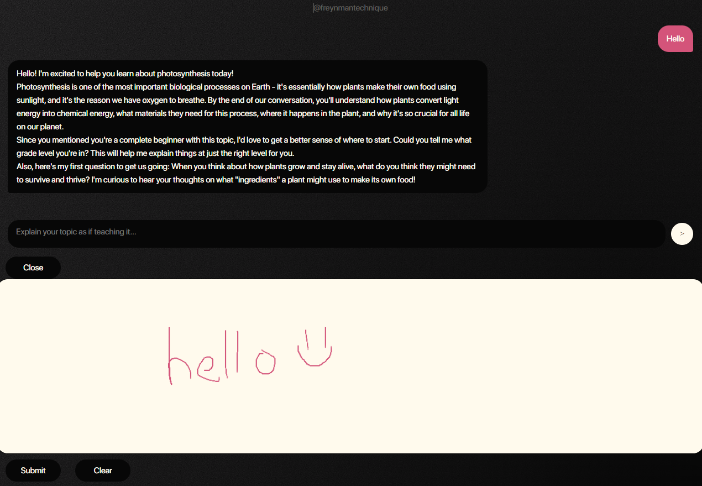

# @ProjectAstreae!
--

## Status: In Development

--
## About the Developer
Hello, and welcome to @ProjectAstreae! I'm Aditi Divakar, a newly starting developer in the realm of app development and software services. I want to build the next big project that solves a large communal goal, serves large, serviceable impact and stands against the world of tech. 

I think the first thing you'll notice is that it's VERY simple and probably not the very best in terms of UI and features. However, this is just a test server that I wanted to make to test AI possibilities, certain features and more to put into a bigger, more refined project! So, do take the slight errors and messiness with a grain of salt. Anywho, this is my first true experimentation with AI technology, and I'm super excited to get into new, more advanced projects in the future! Contact me if you'd like to help or join the team!

--
## What is @ProjectAstreae?
@ProjectAstreae is a study productivity app that prioritizes learning by understanding. It uses the Feynman technique to engage its user, speak through brief explanations, probing questions and teaching-style learning methods. When you enter the site, create a new chat, then, proceed with the onboarding questions. Once there, go ahead and send a message, or whatever you know about the topic. The AI will respond, and go ahead and engage! You can also utilize the whiteboard feature to further explain/elaborate on an idea, problem or more visual topic; or the AI can also ask questions that require work on the whiteboard. We're still in development for more studying tools, so watch out!

--
## Features
- Comprehensive and easy to follow onboarding systems that help the AI better cater to your needs

- File upload ability that helps you study specific materials, allow the AI to use only that reference, and so much more
- Minimalistic and easy flow
- Session logs that can be revisited to view past conversations. These can also be deleted, and the AI remembers past information/conversations

- Interactive whiteboard feature that allows the user to represent/display visual materials or topics. The AI can also prompt users to solve/use the whiteboard in their explanations or learning. 

- Fun interactive UI and Mapbox background feature

--
## Want to run locally?
Here's how you can run the server locally:
1. Clone the repo here
2. Run `npm install` in the terminal
3. Create a `.env` file that includes:
- API_KEY= your anthropic key (visit [claude](https://platform.claude.com/) -> create account -> get free API key)
- MAPBOX_TOKEN= your mapbox token ([mapbox.com](https://www.mapbox.com/) -> create account -> get mapbox token)
4. Run `node server.js`
5. Open `http://localhost:3000`

And there you go! Have fun with it!

## Tech Stack
- Node.js, Express
- Vanilla JavaScript
- HTML
- CSS
- Mapbox GL JS
- Anthropic Claude API
- PDF.js, Marked.js

--
## Help and Support
Need help, support, or want to make a query/suggestion? Go ahead and email me at divakaraditi6@gmail.com!

--

## License: MIT

Thanks for viewing! 
Love, Aditi ♥